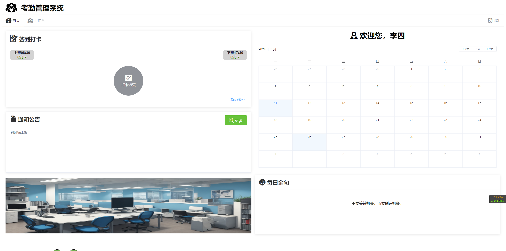
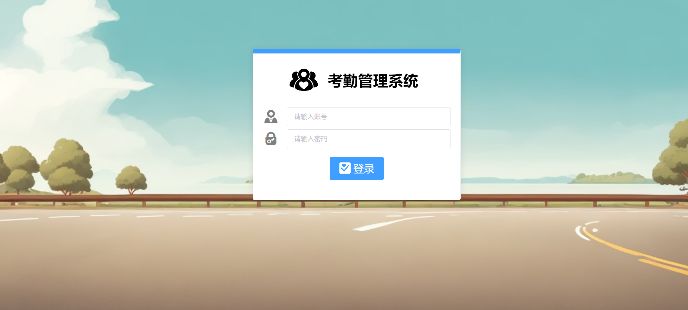
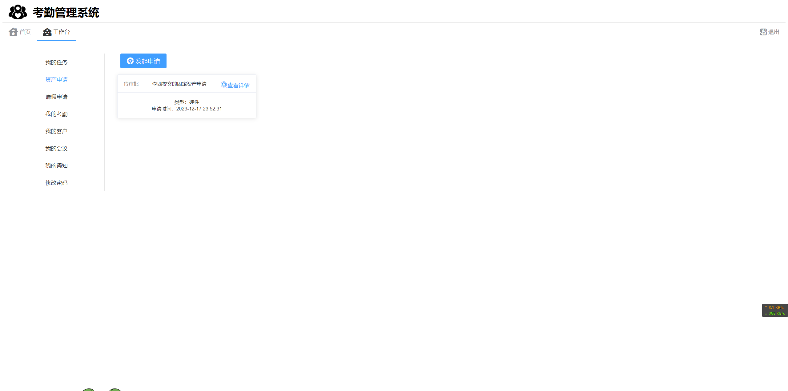
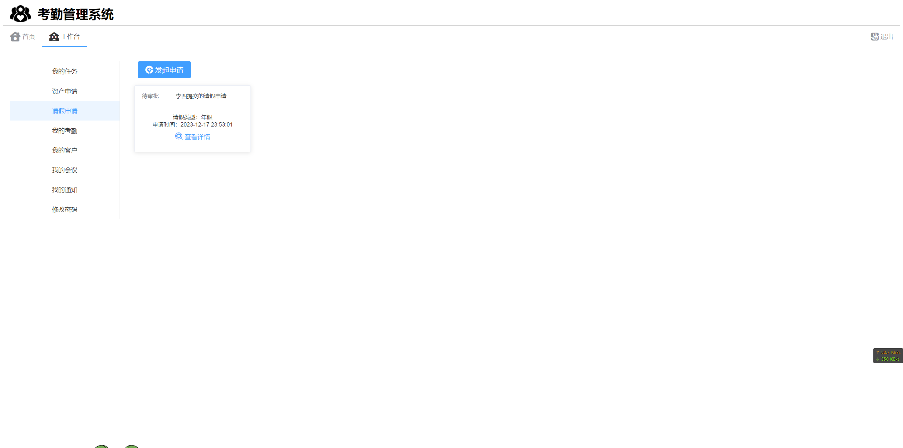
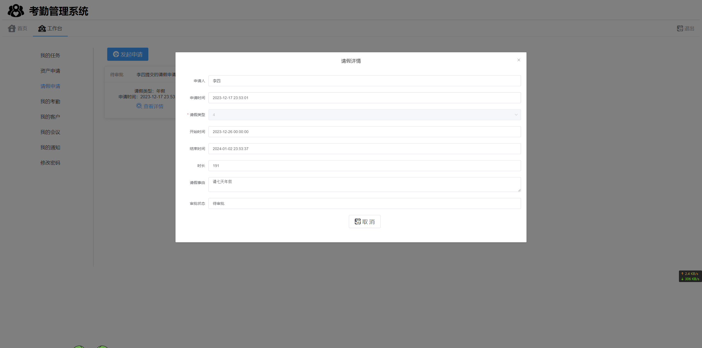
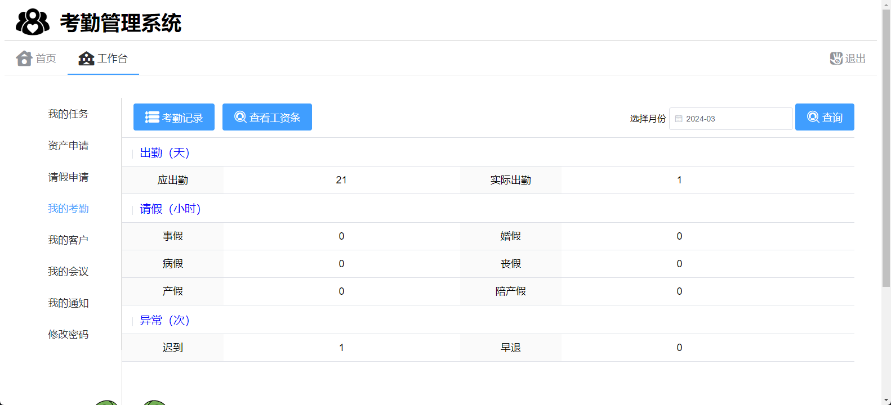
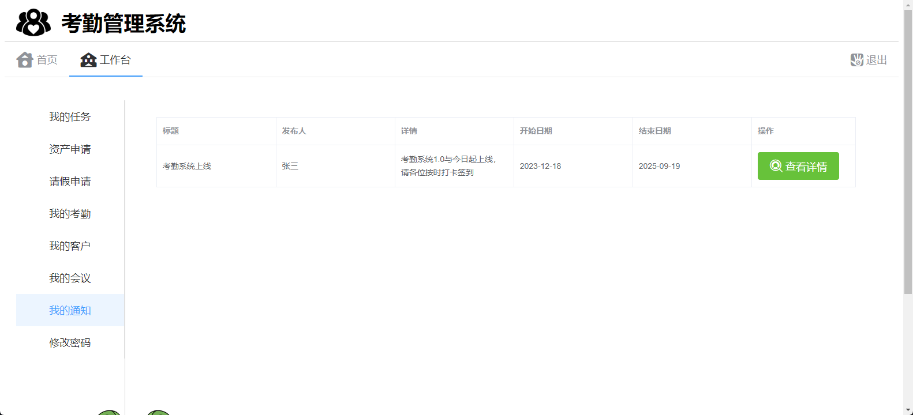
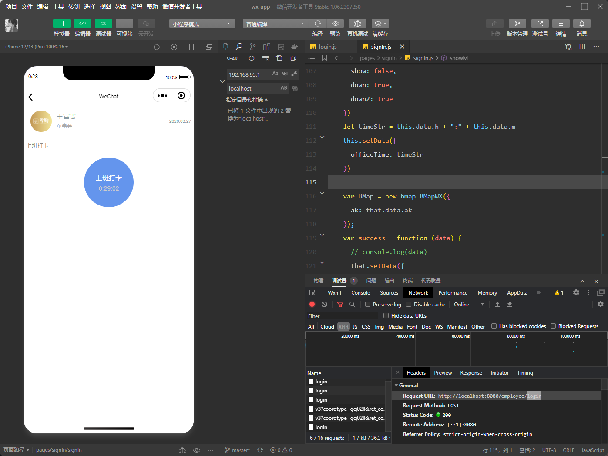
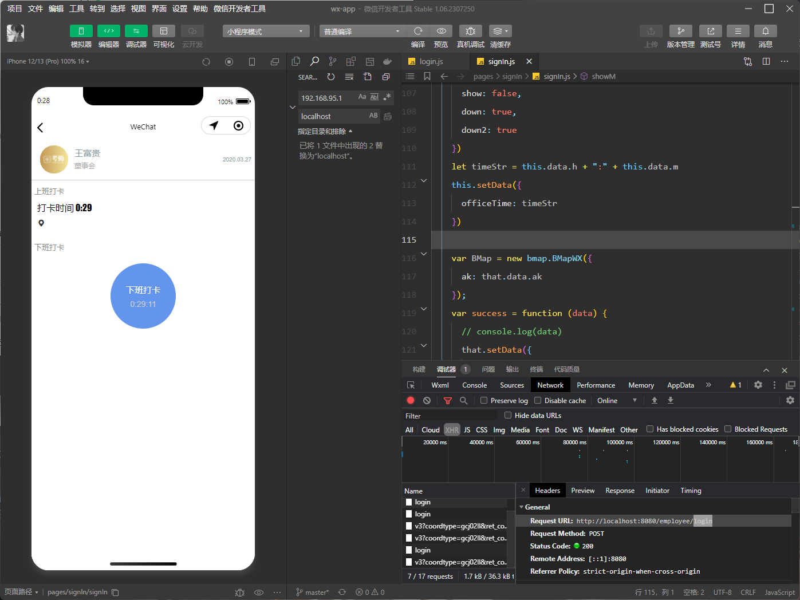

# 员工考勤系统

#### 介绍
基于Springboot+Vue的考勤管理系统，在实际项目中可以直接复用。

#### 软件架构
软件架构说明
前端采用vue2.js编写， 后端采用Spring Boot，数据库为mysql

PS： 图片加载不出来可以去码云看：https://gitee.com/xiaoxu_1_365855675/employee-attendance-system
#### 程序截图

## 联系我
微信：xtb365 可有偿提供源码、技术咨询等等， 备注来意

